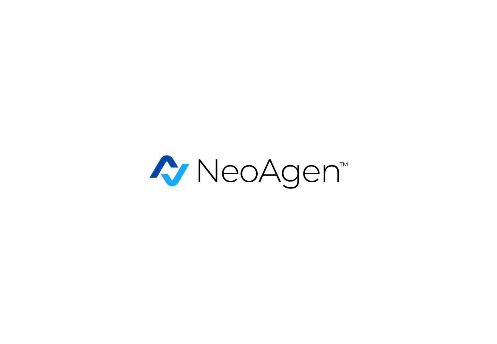
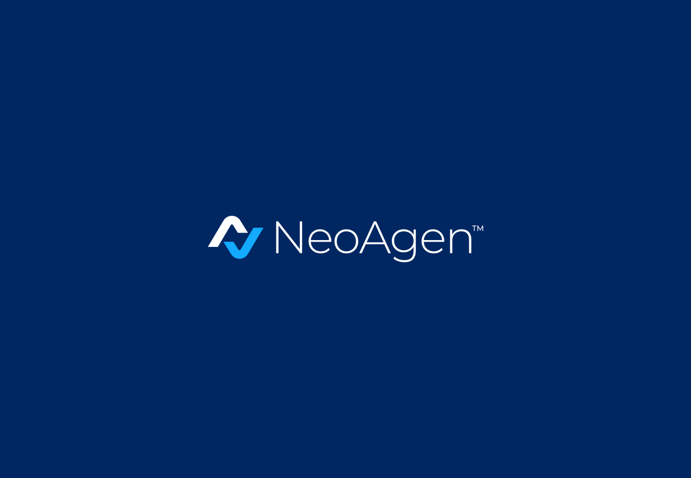
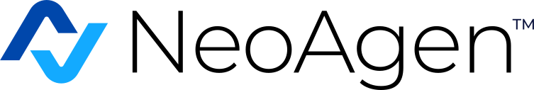
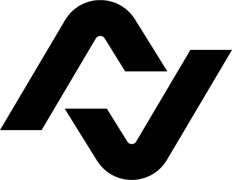
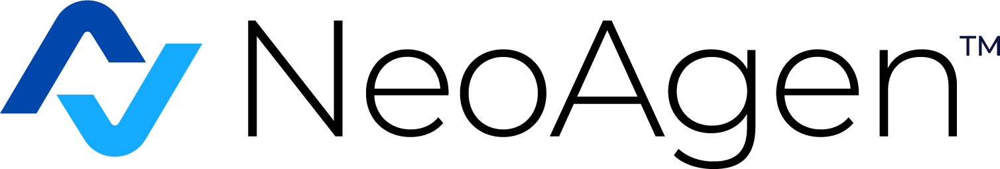

# NeoAgen Brand Assets

Official brand assets for NeoAgen applications and digital products.

## Quick Start

```html
<!-- Primary logo for light backgrounds -->


<!-- Logo for dark backgrounds -->


<!-- Compact horizontal layout -->


<!-- Standalone icon -->

```

## Assets Structure

```
assets/
├── logos/
│   ├── svg/                    # Vector logos (recommended)
│   │   ├── logo-primary.svg    # Main logo for light backgrounds
│   │   ├── logo-reversed.svg   # Logo for dark backgrounds  
│   │   ├── logo-monochrome.svg # Single-color version
│   │   └── logo-horizontal.svg # Compact horizontal layout
│   └── png/                    # Raster logos (multi-resolution)
│       ├── logo-horizontal@1x.png
│       ├── logo-horizontal@2x.png
│       └── logo-horizontal@3x.png
├── icons/
│   ├── svg/
│   │   └── emblem.svg          # Standalone icon/emblem
│   └── png/
│       ├── emblem@1x.png
│       ├── emblem@2x.png
│       └── emblem@3x.png
└── favicons/
    ├── favicon-16x16.png       # Standard favicon
    └── favicon-32x32.png       # Large favicon
```

## Brand Colors

| Color | Hex | Usage |
|-------|-----|-------|
| Primary Blue | `#0047ab` | Main brand color, emblem |
| Light Blue | `#13aaff` | Secondary accent color |
| Dark Navy | `#0d153f` | Text, dark backgrounds |
| White | `#ffffff` | Light backgrounds, reversed text |
| Black | `#000000` | Monochrome applications |

## Usage Guidelines

### Logo Variants

- **Primary Logo** (`logo-primary.svg`): Use on light backgrounds, full-color applications
- **Reversed Logo** (`logo-reversed.svg`): Use on dark backgrounds  
- **Monochrome Logo** (`logo-monochrome.svg`): Single-color applications, embossing
- **Horizontal Logo** (`logo-horizontal.svg`): Compact spaces, headers, navigation

### File Format Recommendations

- **SVG**: Preferred for web/digital applications (infinitely scalable, small file size)
- **PNG**: Use when SVG isn't supported, choose appropriate resolution (@1x, @2x, @3x)
- **Favicons**: Ready-to-use for websites

### Minimum Sizes

- **Full Logo**: Minimum height 24px (digital), 0.5" (print)
- **Horizontal Logo**: Minimum height 20px (digital), 0.25" (print)  
- **Icon/Emblem**: Minimum 16px (digital), 0.125" (print)

### Clearspace

Maintain clearspace around logos equal to the height of the "N" in the emblem on all sides.

### Do's and Don'ts

✅ **Do:**
- Use provided color variants
- Maintain proper clearspace
- Use SVG when possible for crisp scaling
- Choose appropriate variant for background

❌ **Don't:**
- Modify colors, proportions, or typography
- Use low-resolution versions when high-res is available
- Place logo on busy or low-contrast backgrounds
- Stretch, skew, or rotate the logo

## Implementation Examples

### HTML/CSS
```html
<!-- Responsive logo with fallback -->
<picture>
  <source media="(min-width: 768px)" srcset="assets/logos/svg/logo-primary.svg">
  
</picture>
```

### React/JSX
```jsx
import logo from './assets/logos/svg/logo-primary.svg';

function Header() {
  return (
    
  );
}
```

### CSS Background
```css
.logo {
  background-image: url('assets/logos/svg/logo-primary.svg');
  background-size: contain;
  background-repeat: no-repeat;
  height: 40px;
  width: 120px;
}
```

### Favicon Implementation
```html
<link rel="icon" type="image/png" sizes="32x32" href="assets/favicons/favicon-32x32.png">
<link rel="icon" type="image/png" sizes="16x16" href="assets/favicons/favicon-16x16.png">
```

## License

These brand assets are proprietary to NeoAgen. Usage is restricted to official NeoAgen applications and authorized partners.

## Support

For questions about brand usage or additional assets, contact the NeoAgen design team.